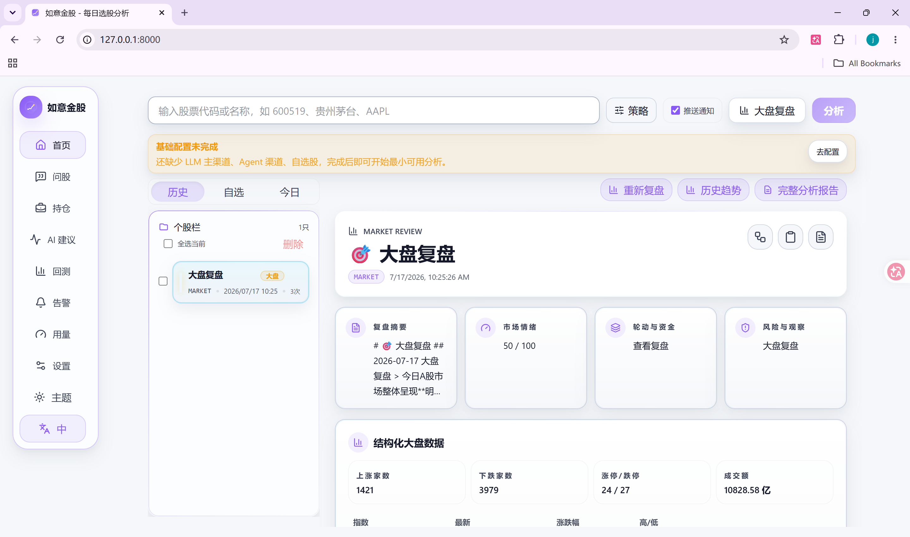
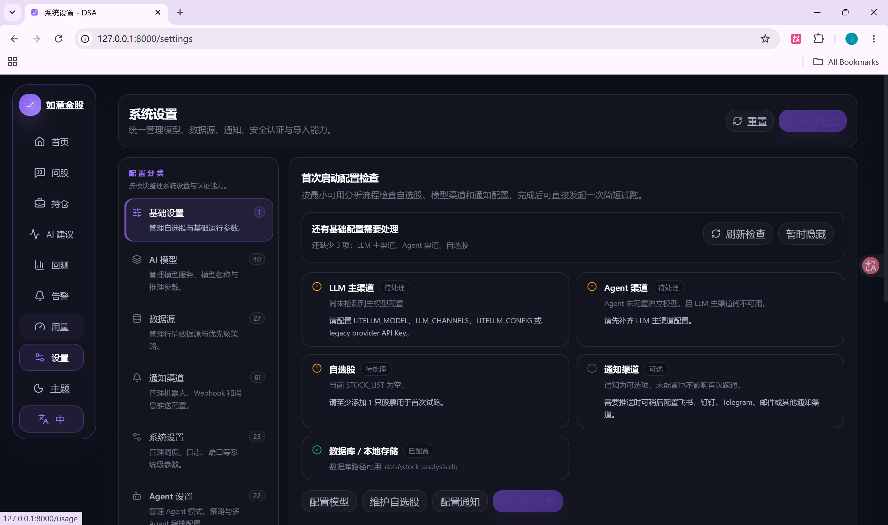

<div align="center">

# 📈 如意金股 · RuyiDailyStockAnalysis

> 作者：momo

[](https://opensource.org/licenses/MIT)
[](https://www.python.org/downloads/)

</div>

---

## 📸 产品预览

| Web 深色主题 | 浅色主题 |
|:---:|:---:|
|  |  |

---

## ✨ 核心功能

| 模块 | 说明 |
|------|------|
| **AI 决策报告** | 核心结论、评分、买卖点位、风险警报、催化因素 |
| **多市场覆盖** | A股 / 港股 / 美股 / 日股 / 韩股 / 台股 |
| **Web 工作台** | 手动分析、任务进度、历史报告、回测、持仓管理 |
| **Agent 问股** | 均线、缠论、波浪、趋势、热点等 15+ 内置策略 |
| **自动化推送** | 企业微信 / 飞书 / Telegram / Discord / Slack / 邮件 |

---

## 🚀 快速开始

```bash
# 克隆项目
git clone https://github.com/jinming-lv/stock_analysis.git
cd stock_analysis

# 安装依赖
pip install -r requirements.txt

# 配置环境变量
cp .env.example .env

# 启动 Web 服务
python main.py --serve-only --host 127.0.0.1 --port 8000
```

访问 `http://127.0.0.1:8000` 即可使用。

---

## 🔧 环境变量

| 变量 | 说明 | 必填 |
|------|------|:----:|
| `STOCK_LIST` | 自选股代码，如 `600519,hk00700,AAPL` | ✅ |
| `OPENROUTER_API_KEY` | OpenRouter API Key | 推荐 |
| `SILICONFLOW_API_KEY` | 硅基流动 API Key | 推荐 |
| `WECHAT_WEBHOOK_URL` | 企业微信机器人 | 可选 |
| `FEISHU_WEBHOOK_URL` | 飞书机器人 | 可选 |

---

## 📦 技术栈

| 类型 | 技术 |
|------|------|
| 后端 | Python 3.10+ / FastAPI / Uvicorn |
| 前端 | React / TypeScript / Vite / Tailwind |
| 数据源 | AkShare / Tushare / YFinance |
| AI 模型 | OpenRouter / 硅基流动 / Gemini / DeepSeek |
| 部署 | Docker / GitHub Actions |

---

## 📄 License

[MIT License](LICENSE) © 2026 momo

---

## ⚠️ 免责声明

本项目仅供学习研究，不构成投资建议。股市有风险，投资需谨慎。

---